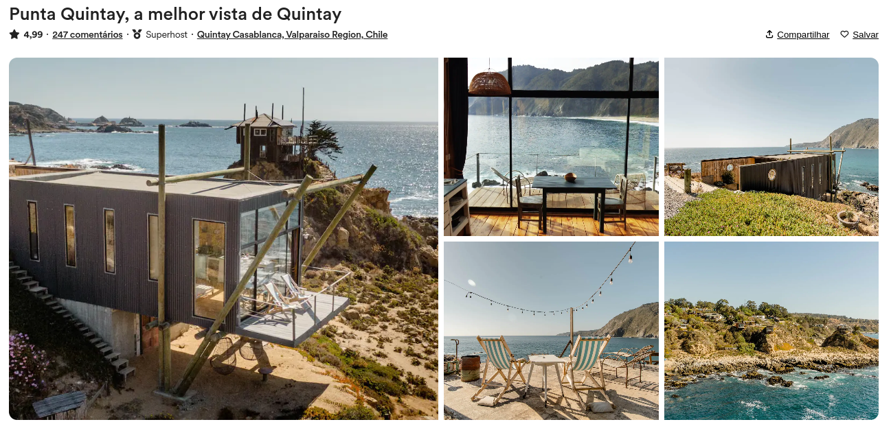

<h1 align="center">
  Repositório template - Tela do airbnb
</h1>

## 💻 Projeto

- uso de display grid/flex e seletores CSS. 
- técnicas de interface 
- renderização de imagens 

## 📝 Aprendizados

- [x] Uso da propriedade **grid** do `display`
- [x] Uso do seletor `not` do css
- [x] Uso do seletor `has` do css
- [x] Animação com a propriedade `scale` do css

